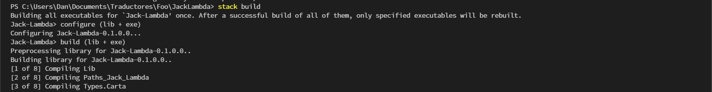
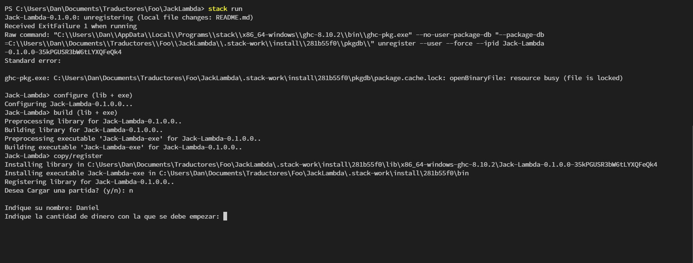

# JackLambda

## Requisitos

La manera mas facil de conseguir la suite completa de Haskell es siguiendo las instrucciones de su [pagina oficial](https://www.haskell.org/platform/#linux-debian), es de extremada importancia verificar que la  herramienta [Stack](https://docs.haskellstack.org/en/stable/README/) se haya instalado despues despues de seguir los pasos anteriores. (Stack es el equivalente en Haskell a Conda para Python o Maven para Java).

## Buildear Y correr

Para buildear el proyecto basta con realizar: `stack build` en una terminal:

Esto no solo instalara todas las dependencias ubicadas en el apartado `dependencies` de `package.yaml`, sino que tambien instalara a nivel de proyecto la version de GHC especificada en el apartado `resolver` de `stack.yaml`, tal cual como si se trabajaria en Node.

Si por alguna razon, stack fallara al instalar las dependencias, basta con hacer: `stack install` o `stack install random` e `stack install mtl` para instalarlas. Nota: estas se instalaran **solo** a nivel de proyecto, si se desea instalar a nivel global se debera ejecutar los comandos fuera de cualquier proyecto stack.

Finalmente, bastara con ejecutar `stack run` para correr el proyecto:

## Portabilidad

Debido a que el proyecto es extremadamente simple, y solo utiliza 2 librerias estandar (random y mtl), debe correr en cualquier OS con la suite de haskell.

